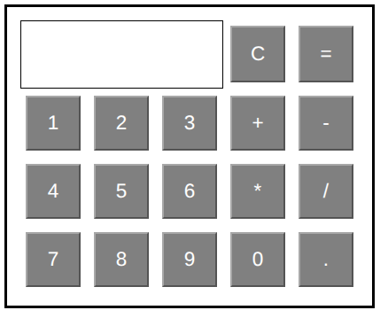
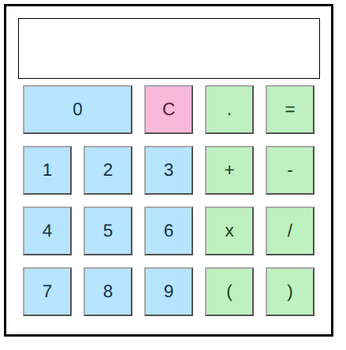

# Frontend Calculator

## A short story about this project

This project started as my personal frontend practice, long before I used AI tools.

<p align="center">
  
</p>

The old version in `old_version/HtmlPage1.html` was built with hard work and many trial-and-error attempts. It had a lot of mistakes, but it was my honest best effort. For detail: [Old_Version_Review](old_version/Old_Version_Review.md)

Now I look back, improve it, and try to give back by sharing a better version publicly for everyone who wants to use it or learn from it.

<p align="center">
  
</p>

Live site:
https://noa-jou.github.io/A-Frontend-Calculator/


## Why the new version is in docs

I put the new version files in the [docs](docs) folder for GitHub Pages publishing.

GitHub Pages can publish from a selected folder, and this repository is configured so files inside [docs](docs) are served on the live site.Reference:
https://docs.github.com/en/pages/getting-started-with-github-pages/creating-a-github-pages-site

Because of this setup, the [live site](https://noa-jou.github.io/A-Frontend-Calculator/) are as I mentioned before.


## What this new version offers

- Still built with basic HTML, CSS, and JavaScript (no framework)
- Cleaner calculation logic with correct operator precedence
- Parentheses support, including nested parentheses and unary +/- handling
- Multiplication input flexibility: `x`, `X`, and `*` are treated the same
- Better input validation and clearer error handling for invalid expressions
- Keyboard support (Enter, Backspace, Escape, C)
- Safer behavior for edge cases like divide-by-zero and malformed input
- Cleaner display formatting for common floating-point noise (example: `0.30000000000000004` -> `0.3`)
- A visual test dashboard with step-by-step categories (availability, math, accessibility, security, and fuzz/invariant checks)


## What this new version still limits

- Decimal results are formatted for readability, so very long decimal tails are rounded in the display.
- The calculator uses JavaScript number precision, so the last few digits of repeating decimals may be rounded (example: `2/3` shows as `0.666666666666667`).
- Locale formats and advanced math syntax are not supported yet (for example comma decimals like `3,14`, scientific notation, or function-style input).


## Run on your own computer (for your own modification)

1. Clone this repository.
2. Open a terminal in the project root.
3. Run:

```bash
cd docs
python3 -m http.server 8080
```

4. Open in your browser:

- http://localhost:8080/calculator.html
- http://localhost:8080/availability_and_math_correct_test.html

5. Edit files, refresh the browser, and test your own changes.


## Why I share this

I hope this project helps all learners like me understand how to handle calculations correctly on the frontend using only core web frontend technologies.

I improved this version with help from ChatGPT and GitHub Copilot, and I am grateful for that support.

If this project is useful to you, I will be very happy.


## Support my creation 

[Buy me a coffee](https://buymeacoffee.com/noajou)
